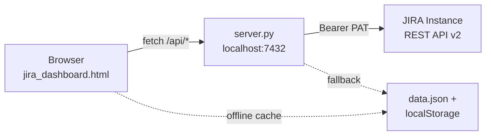

# JIRA Sprint Dashboard

A local, single-page dashboard for tracking sprint work on any JIRA instance — sprint health, story points, personal analytics, team visibility, and manager oversight. One HTML file, one Python proxy, no build step.

---

## At a glance

| | |
|---|---|
| **What it does** | Pulls your assigned tickets from JIRA, visualizes sprint progress, and surfaces insights (burndown, cycle time, stale work, standups, achievements). |
| **Who it's for** | Individual contributors (Overview, My Stuff), peers (Team), and leads (Manager). |
| **How it runs** | `jira_dashboard.html` in the browser + `server.py` proxy on port **7432** for live API access. |
| **Auth** | JIRA Personal Access Token via **Settings** in the UI or `JIRA_TOKEN` env var. Falls back to `data.json` + `localStorage` when offline. |

---

## Quick start

### 1. Configure your JIRA instance

```bash
export JIRA_URL=https://your-jira-instance.com
export JIRA_TOKEN=your-personal-access-token
```

Or paste the token in **Settings** (stored in `localStorage` and sent as `X-Jira-Token` on API calls).

### 2. Start the server

```bash
python3 server.py
```

### 3. Open the dashboard

```
http://localhost:7432/jira_dashboard.html
```

### 4. Click "Reload Data" to fetch the latest tickets from JIRA.

---

## Architecture



**Why a proxy?** Browsers block credentialed cross-origin requests from `localhost`. `server.py` adds CORS headers, handles SSL certificates, resolves epic names, and aggregates team/manager queries in parallel threads.

---

## Four main tabs

### Overview

Your day-to-day sprint workspace.

- **Stat cards** — Total tickets, In Progress, Assigned, Closed, On Hold, Total SP (current sprint).
- **Charts** — Status donut, priority bars, SP by sprint (stacked), burndown with risk badge, cycle time by priority, component cloud, 6-month cycle-time trend, sprint velocity.
- **Insights banner** — Auto-generated sprint health messages (stale warnings, celebrations).
- **What changed** — Collapsible panel of updates since yesterday.
- **Stale sprint cleanup** — Tickets still open in closed sprints.
- **Sprint overview** — Switch Current / Previous / Earlier; compare mode; progress bars.
- **Ticket table** — Search, multi-filter (status, priority, sprint, component, epic, date range), sort, pagination, aging badges, subtask bars, missing-field warnings, epic links.

**Top bar actions:** Standup, Pomodoro timer, Focus mode, theme toggle, streak display, Reload Data, Settings.

### My Stuff

Personal performance over the last **6 months** (via `/api/history`).

- Hero metrics — P1s resolved, tickets closed, SP delivered, sprints contributed, avg SP/sprint.
- Sprint performance, priority breakdown, P1 incident list.
- Top components & epics, SLA tracker (P1/P2 resolution vs targets).
- Mentions feed, impact scorecard, activity heatmap.
- Skills / expertise map, aging tickets report.
- **Achievements** — Gamified badges (P1 milestones, SP sprint, hat trick, streak, century club, speed demon).

### Team

On-demand team leaderboard (`/api/team`).

- Loads stats for all configured teammates in parallel.
- Rankings by closed SP, closed count, all-time closed, current P1 count.
- Click **Load Team Data** when you first open the tab.

### Manager

Deep visibility for leads (`/api/manager`, `/api/manager-changes`).

- Summary cards across the team.
- "Current work" matrix — who is on what right now.
- Expandable per-member cards with current + recently closed tickets.
- Team-wide **What changed since yesterday**.
- Filters by member, status, priority.

---

## Features by category

### Sprint & velocity

| Feature | Description |
|---------|-------------|
| Burndown chart | Ideal vs actual burn with sprint risk indicator (low / medium / high) |
| Velocity trend | SP completed per sprint vs committed |
| SP breakdown | Closed / In Progress / Assigned / On Hold bars + completion rate |
| Sprint comparison | Toggle sprints or compare side-by-side |

### Quality & hygiene

| Feature | Description |
|---------|-------------|
| Ticket aging | Fresh / warm / stale / critical badges from last update |
| Stale panel | Open tickets left in closed sprints |
| Missing fields | Flags missing Story Points, Component, or Epic |
| Duplicate detection | Jaccard similarity on summaries (`/api/duplicates`) |
| P1 age | Critical ticket age surfaced in the table |

### Productivity & focus

| Feature | Description |
|---------|-------------|
| Focus mode | In-progress tickets only (`Cmd/Ctrl + Shift + F`) |
| Pomodoro widget | Built-in 25-minute timer |
| Streak tracker | Consecutive days with ticket closures |
| Command palette | `Cmd/Ctrl + K` — search, reload, export, standup, theme, etc. |
| Saved filters | Name and recall filter presets |

### Collaboration

| Feature | Description |
|---------|-------------|
| Standup report | Yesterday / today / blockers with copy-to-clipboard |
| Comment feed | Latest comments per ticket (`/api/comments`) |
| Mentions | Tickets where you're @mentioned (`/api/mentions`) |
| Team leaderboard | Peer sprint stats |

### Export & sharing

| Feature | Description |
|---------|-------------|
| CSV export | Filtered table to spreadsheet (`Cmd/Ctrl + E`) |
| JQL copy | Generate JQL from active filters |
| Sprint report modal | Sprint summary document |
| Performance export | Review-ready summary from history data |

### Offline & resilience

| Feature | Description |
|---------|-------------|
| `data.json` | Server-side fallback when auth fails |
| `localStorage` | Client cache of last successful fetch |
| Stale banner | Clear warning when viewing cached data |
| Loading states | Skeleton UI during refresh |

---

## API endpoints

All routes are served by `server.py` on `http://localhost:7432`. Most require a PAT (header `X-Jira-Token` or env `JIRA_TOKEN`).

| Endpoint | Description |
|----------|-------------|
| `GET /api/config` | Returns JIRA base URL for the frontend |
| `GET /api/myself` | Current user display name from JIRA |
| `GET /api/tickets` | Current + 2 previous sprints for assignee |
| `GET /api/history` | 6-month history, SLA, cycle-time trend, performance export |
| `GET /api/team` | Team member sprint stats + leaderboard ranks |
| `GET /api/manager` | Per-member current + recently closed tickets |
| `GET /api/manager-changes` | Team-wide changes since a date |
| `GET /api/changes` | Your ticket changes since a date |
| `GET /api/standup` | Yesterday closed, today WIP, blockers |
| `GET /api/stale` | Open tickets in closed sprints |
| `GET /api/comments?key=PROJ-123` | Latest comments on a ticket |
| `GET /api/mentions` | Tickets mentioning you (last 30d) |
| `GET /api/duplicates` | Potential duplicate pairs (Jaccard > 50%) |
| `POST /api/update` | Pull latest from git and restart server |

---

## Configuration

### Environment variables

| Variable | Required | Description |
|----------|----------|-------------|
| `JIRA_URL` | No | Base URL of your JIRA instance (default: `https://jira.example.com`) |
| `JIRA_TOKEN` | No | Personal Access Token for server-side auth (can also set via UI) |

### Team roster

Edit the `TEAMMATES` list in `server.py` to configure which users appear in the Team and Manager tabs:

```python
TEAMMATES = [
    {"display": "Jane Doe",  "user": "jdoe"},
    {"display": "John Smith", "user": "jsmith"},
]
```

### Custom fields

JIRA custom field IDs are configured at the top of `server.py`. Adjust these to match your JIRA instance:

| Field | Custom field key |
|-------|-----------------|
| Story Points | `customfield_10403` |
| Sprint | `customfield_11501` |
| Epic Link (legacy) | `customfield_12003` |
| Parent / Epic (new) | `parent` |

---

## Keyboard shortcuts

| Shortcut | Action |
|----------|--------|
| `Cmd/Ctrl + K` | Open command palette |
| `Cmd/Ctrl + E` | Export CSV |
| `Cmd/Ctrl + Shift + F` | Toggle Focus Mode |
| `Cmd/Ctrl + Shift + H` | Toggle Team tab visibility |
| `Esc` | Close modals / exit Focus Mode |
| `?` | Show shortcuts hint |

---

## Troubleshooting

**Directory listing instead of the dashboard**
Open `http://localhost:7432/jira_dashboard.html` (not the root URL).

**"Could not reach the local proxy server"**
Start `python3 server.py`. Cached `localStorage` data may still display.

**401 / auth failed**
Regenerate your PAT. Set via Settings or `export JIRA_TOKEN=...`. Dashboard falls back to `data.json`.

**SSL errors**
`server.py` disables SSL verification by default for self-signed certificates. Adjust `ssl_ctx()` if needed.

**Empty charts with live server**
No token or JIRA returned no issues — check PAT and assignee filter (`assignee = currentUser()`).

**Team / Manager tabs empty**
Click **Load Team Data** or **Load Manager View**. These tabs intentionally defer heavy parallel fetches.

---

## Project files

| File | Purpose |
|------|---------|
| `jira_dashboard.html` | Full UI — charts (Chart.js), table, tabs, modals |
| `server.py` | Local proxy, JIRA fetch logic, API routes |
| `data.json` | Cached fallback payload |

---

## License

MIT. Created by Haseeb Nain.
